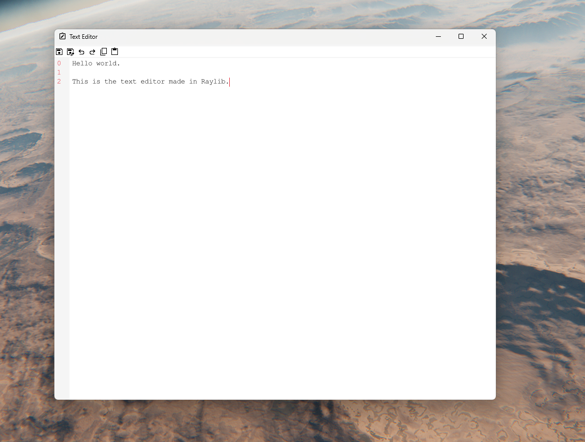

# Simple Raylib Text Editor

This is a basic text editor built from scratch using C++ and the Raylib library.
This editor utilizes a Piece Table data scructure for efficient text manipulation.

## Preview



## Features

* **File Operations:** Open, Save, Save As.
* **Editing:** Copy, Paste, Undo, Redo.
* **Navigation:**
    * Move the cursor using the **Arrow Keys**.
    * Select text by holding **Shift** while moving the cursor with **Arrow Keys**.
    * Scroll through the text using the **Mouse Wheel**.


## Building from Source

You can compile the editor yourself using `make`.

1.  **Prerequisites:** Ensure you have a C++ compiler (like g++) and `make` installed. You also need the Raylib library development files set up correctly for your system.
2.  **Clone the repository:**
    ```bash
    git clone https://github.com/matteoppet/Text-editor.git
    cd repository_name
    ```
3.  **Build:**
    ```bash
    make
    ```
    This will generate an executable file (e.g., `editor.exe`) in the project directory.

## Download

A pre-compiled executable for Windows is available on the [GitHub Releases page](https://github.com/matteoppet/Text-editor/releases/tag/v1.0.0).

## Credits

This project uses the following excellent libraries:

* [Raylib](https://www.raylib.com/) - For graphics and input handling.
* [Tiny File Dialogs](https://sourceforge.net/projects/tinyfiledialogs/) - For native open/save file dialogs.

## Contributing

Contributions are welcome! Feel free to open an issue or submit a pull request if you have suggestions or improvements.